# LearnTube AI Career Coach

An intelligent career coaching application that analyzes LinkedIn profiles and provides personalized career guidance through AI-powered agents.

## Architecture Overview

- **Frontend**: Streamlit-based interactive chatbot
- **Backend**: FastAPI with LangGraph multi-agent system
- **Database**: Google Firestore
- **AI Orchestration**: LangGraph with specialized agents
- **LinkedIn Scraping**: Apify integration (Actor ID: 2SyF0bVxmgGr8IVCZ)

## Features

- 🚀 Interactive chat interface with AI career coach
- 📊 Job fit analysis with percentage scoring
- 🛤️ Personalized career path recommendations
- 📝 LinkedIn profile enhancement suggestions
- 💬 Persistent conversation memory
- 👤 Real-time profile updates
- 🎯 Quick action buttons for common queries

## Project Structure

```
learntube-ai/
├── backend/ # FastAPI backend
│ ├── app/
│ │ ├── main.py # FastAPI app
│ │ ├── agents/ # LangGraph agents
│ │ │ ├── langgraph_orchestrator.py
│ │ │ ├── router_agent.py
│ │ │ ├── job_fit_analyst.py
│ │ │ ├── career_path_agent.py
│ │ │ ├── profile_updater.py
│ │ │ ├── content_enhancement_agent.py
│ │ │ └── state.py
│ │ ├── models/ # Pydantic models
│ │ ├── services/ # Business logic
│ │ └── config.py # Configuration
│ ├── requirements.txt # Python dependencies
│ ├── run.py # Server startup script
│ ├── env_template.txt # Environment template
│ └── README.md # Backend documentation
├── frontend/ # Streamlit frontend
│ ├── streamlit_app.py # Main Streamlit app
│ ├── requirements.txt # Python dependencies
│ └── README.md # Frontend documentation
├── run_app.bat # Windows convenience script
├── run_app.ps1 # PowerShell convenience script
├── learntube-.json # Firebase credentials
└── README.md # This file
```

Technical Workflow Architecture:

```mermaid
flowchart TB
    User["👤 User"] --> StreamlitUI["🎨 Streamlit Frontend\nPort: 8501"]
    StreamlitUI -- Start Session --> StartSession["📝 Enter LinkedIn URL"]
    StreamlitUI -- Chat Message --> ChatInput["💬 Send Message"]
    StreamlitUI -- Quick Actions --> QuickButtons["🎯 Job Analysis\n📝 Profile Enhancement\n🛤️ Career Path"]
    StartSession -- POST /start_session --> FastAPI["🚀 FastAPI Backend\nPort: 8000"]
    ChatInput -- POST /chat --> FastAPI
    QuickButtons -- POST /chat --> FastAPI
    FastAPI -- LinkedIn URL --> ApifyService["🔗 Apify LinkedIn Scraper\nActor: 2SyF0bVxmgGr8IVCZ"]
    ApifyService -- Profile Data --> ProfileProcessor["📊 Profile Data Processor"]
    ProfileProcessor -- Structured Data --> FirebaseService["🔥 Firebase Service"]
    FastAPI --> SessionManager["🗂️ Session Manager"]
    SessionManager -- Create/Get Session --> FirebaseService
    FastAPI -- User Query + Profile --> LangGraphOrchestrator["🧠 LangGraph Orchestrator\nMulti-Agent System"]
    LangGraphOrchestrator --> RouterAgent["🎯 Router Agent\nQuery Analysis & Routing"]
    RouterAgent -- Job Description --> JobFitAgent["📊 Job Fit Analyst\n- Calculate Match Score\n- Missing Skills Analysis\n- Enhancement Suggestions"]
    RouterAgent -- Career Questions --> CareerPathAgent["🛤️ Career Path Agent\n- Career Trajectory\n- Upskilling Areas\n- Timeline Planning"]
    RouterAgent -- Profile Updates --> ProfileUpdaterAgent["👤 Profile Updater\n- Extract New Info\n- Update User Data\n- Skill Recognition"]
    RouterAgent -- Content Requests --> ContentAgent["📝 Content Enhancement\n- LinkedIn Optimization\n- Headline Suggestions\n- About Section"]
    JobFitAgent -- Prompt + Context --> OpenRouterAPI["🤖 OpenRouter API\nGPT-4 Models"]
    CareerPathAgent --> OpenRouterAPI
    ProfileUpdaterAgent --> OpenRouterAPI
    ContentAgent --> OpenRouterAPI
    RouterAgent --> OpenRouterAPI
    OpenRouterAPI -- AI Response --> ResponseProcessor["⚙️ Response Processor"]
    ResponseProcessor -- Structured Output --> StateManager["📋 Graph State Manager"]
    StateManager -- Update Profile --> FirebaseService
    StateManager -- Save Chat History --> FirebaseService
    StateManager -- Conversation State --> FirebaseService
    StateManager -- Final Response --> FastAPI
    FastAPI -- JSON Response --> StreamlitUI
    FirebaseService --> UserProfiles[("👥 User Profiles\n- Name, Skills, Experience\n- LinkedIn Data\n- Session Metadata")] & ChatHistory[("💬 Chat History\n- Messages & Responses\n- Agent Types\n- Timestamps")] & ConversationState[("🧠 Conversation State\n- Graph State\n- Agent Scratchpad\n- Context Memory")]
    ApifyService -. Scraping .-> LinkedInProfiles["🔗 LinkedIn Profiles"]
    OpenRouterAPI -. AI Models .-> OpenAIModels["🧠 OpenAI GPT-4\nClaude, etc."]
    ConfigManager["⚙️ Configuration Manager"] -- API Keys --> ApifyService & OpenRouterAPI
    ConfigManager -- Credentials --> FirebaseService
    ApifyService -- Scraping Failed --> FallbackHandler["⚠️ Fallback Handler\nManual Profile Entry"]
    OpenRouterAPI -- API Error --> FallbackHandler
    FallbackHandler -- Graceful Degradation --> ResponseProcessor
    StreamlitUI -- Session State --> SessionCache["💾 Streamlit Session State\n- Messages History\n- Profile Data\n- UI State"]
```




## Quick Start

### Option 1: One-Click Launch

**For PowerShell users:**
```powershell
.\run_app.ps1
```

**For Command Prompt users:**
```cmd
run_app.bat
```

These scripts will automatically start both the backend and frontend services.

### Option 2: Manual Setup

## Prerequisites

- **Python 3.13+** (required for compatibility)
- Firebase account
- Apify account
- OpenRouter API key

## Setup Instructions

### 1. Backend Setup

1. **Navigate to backend directory:**
   ```bash
   cd backend
   ```

2. **Create virtual environment:**
   ```bash
   python -m venv venv
   # Windows:
   venv\Scripts\activate
   # macOS/Linux:
   source venv/bin/activate
   ```

3. **Install dependencies:**
   ```bash
   pip install -r requirements.txt
   ```

4. **Create environment file:**
   
   Create a `.env` file in the backend directory:
   ```env
   # API Keys
   OPENROUTER_API_KEY=your_openrouter_api_key_here
   APIFY_API_TOKEN=your_apify_api_token_here

   # Firebase Configuration
   FIREBASE_PROJECT_ID=learntube-18ce5
   FIREBASE_CREDENTIALS_PATH=../learntube-18ce5-firebase-adminsdk-fbsvc-8991def342.json
   GOOGLE_APPLICATION_CREDENTIALS=../learntube-18ce5-firebase-adminsdk-fbsvc-8991def342.json

   # Application Configuration
   DEBUG=True
   ```

5. **Run the backend:**
   ```bash
   python run.py
   ```
   
   Backend will be available at: http://localhost:8000

### 2. Frontend Setup

1. **Navigate to frontend directory:**
   ```bash
   cd frontend
   ```

2. **Install dependencies:**
   ```bash
   pip install -r requirements.txt
   ```

3. **Run the Streamlit app:**
   ```bash
   streamlit run streamlit_app.py
   ```
   
   Frontend will be available at: http://localhost:8501

## Required API Keys

### Get Your API Keys:

1. **OpenRouter API Key**: 
   - Visit https://openrouter.ai/
   - Create account and get API key
   - Used for AI model access

2. **Apify API Token**:
   - Visit https://apify.com/
   - Create account and get API token
   - Used for LinkedIn profile scraping

3. **Firebase Setup**:
   - Project ID: `learntube-18ce5` (already configured)
   - Service account JSON file is included in the project

## AI Agents System

The application uses a sophisticated multi-agent system powered by LangGraph:

### 🤖 Available Agents:

1. **Router Agent** - Analyzes user queries and routes to appropriate specialist
2. **Job Fit Analyst** - Analyzes job descriptions and calculates compatibility scores
3. **Career Path Agent** - Provides personalized career guidance and planning
4. **Profile Updater** - Updates user profile based on conversation context
5. **Content Enhancement Agent** - Generates optimized LinkedIn content

### 🔄 Agent Workflow:
1. User sends message → Router Agent analyzes intent
2. Router routes to appropriate specialist agent
3. Specialist processes request using user profile data
4. Response includes structured data + conversational reply
5. Profile automatically updates based on new information

## API Endpoints

- `GET /` - Health check endpoint
- `POST /start_session` - Initialize session with LinkedIn URL
- `POST /chat` - Send message and get AI response
- `GET /profile/{session_id}` - Get user profile data
- `GET /chat_history/{session_id}` - Get conversation history

## Usage Guide

### 1. Starting a Session
- Enter your LinkedIn profile URL, or
- Click "Skip LinkedIn" for manual profile building

### 2. Interacting with the AI
- **Job Analysis**: Paste job descriptions for fit analysis
- **Career Guidance**: Ask about career paths and transitions
- **Profile Help**: Get LinkedIn content suggestions
- **Skill Development**: Identify areas for growth

### 3. Quick Actions
- 📊 **Analyze Job**: Paste a job description for analysis
- 📝 **Improve Profile**: Get LinkedIn optimization tips
- 🎯 **Career Path**: Receive personalized career guidance

## Troubleshooting

### Common Issues:

1. **"Connection Error"**: Ensure backend is running on port 8000
2. **"N/A" values**: Check API keys are correctly set in `.env` file
3. **Import errors**: Verify Python 3.13+ and virtual environment activation
4. **LinkedIn scraping fails**: App works fine without scraping - users can manually share info

## Technology Stack

- **Backend**: FastAPI, LangGraph, LangChain, Pydantic v2
- **Frontend**: Streamlit with custom CSS styling
- **AI Models**: OpenAI GPT-4 via OpenRouter
- **Database**: Google Firestore
- **Scraping**: Apify LinkedIn Actor
- **Deployment**: Containerized for easy deployment
